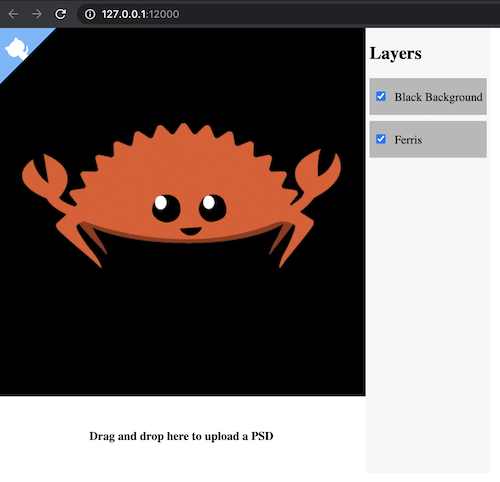

psd
===

[](https://circleci.com/gh/chinedufn/psd) [](https://docs.rs/psd)

> A Rust API for parsing and working with PSD files.

## Live Demo

The `psd` crate can be compiled to WebAssembly and used in a browser.

[In the live demo you can visualize a PSD in the browser](https://chinedufn.github.io/psd/drag-drop-demo/),
toggle layers on and off and drag and drop a new PSD into the demo.



Check out the [examples/drag-drop-browser](examples/drag-drop-browser) directory for instructions on running the demo locally.

## The Psd Book

The _WIP_ [The Psd Book](https://chinedufn.github.io/psd) will contain information about getting started with the `psd` crate,
a description of the architecture and information on how to get started.

## API Docs

Check out the [API documentation](https://chinedufn.github.io/psd/api/psd) to see everything that you can currently access.

## Background / Initial Motivation

I'm working on a game and part of my asset compilation process was a script that did the following:

1. Iterate over all PSD files

2. Export every PSD into a PNG, ignoring any layers that begin with an `_`

3. Combine PNGs into a texture atlas

For a couple of years I was using `imagemagick` to power step 2, but after getting a new laptop and upgrading `imagemagick` versions it stopped working.

After a bit of Googling I couldn't land on a solution for my problem so I decided to make this crate.

My approach was to support as much of the PSD spec as I needed, so there might be bits of information that you'd like to make use of that aren't currently supported.

That said, if there's anything missing that you need [please feel very free to open an issue](https://github.com/chinedufn/psd/issues)!

## Usage

```rust
use psd::{ColorMode, Psd, PsdChannelCompression};

fn main () {
    // .. Get a byte slice of PSD file data somehow ..
    let psd = include_bytes!("./my-psd-file.psd");

    let psd = Psd::from_bytes(psd).unwrap();

    assert_eq!(psd.color_mode(), ColorMode::Rgb);

    // For this PSD the final combined image is RleCompressed
    assert_eq!(psd.compression(), &PsdChannelCompression::RleCompressed);

    assert_eq!(psd.width(), 500);
    assert_eq!(psd.height(), 500);

    // Get the combined final image for the PSD.
    let final_image: Vec<u8> = psd.rgba();

    for layer in psd.layers().iter() {
        let name = layer.name();

        let pixels: Vec<u8> = layer.rgba().unwrap();
    }

    let green_layer = psd.layer_by_name("Green Layer").unwrap();

    // In this layer the red channel is uncompressed
    assert_eq!(green_layer.compression(&PsdChannelKind::Red).unwrap(), PsdChannelCompression::RawData);

    // In this layer the green channel is RLE compressed
    assert_eq!(green_layer.compression(&PsdChannelKind::Green).unwrap(), PsdChannelCompression::RleCompressed);

    // Combine the PSD layers top to bottom, ignoring any layers that begin with an `_`
    let pixels: Vec<u8> = psd.flatten_layers_rgba(&|(_idx, layer)| {
        !layer.name().starts_with("_")
    }).unwrap();
}
```

## See Also

- [PSD specification](https://www.adobe.com/devnet-apps/photoshop/fileformatashtml/) - the basis of our API

## License

MIT
